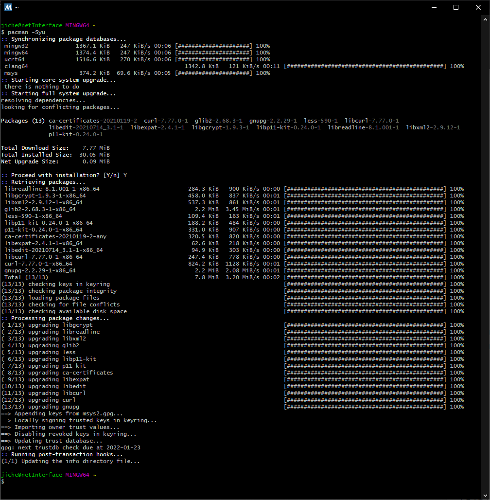
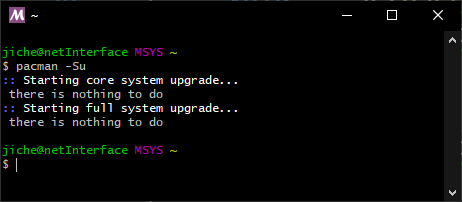
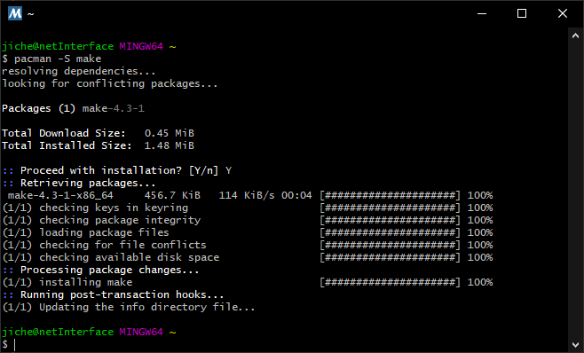
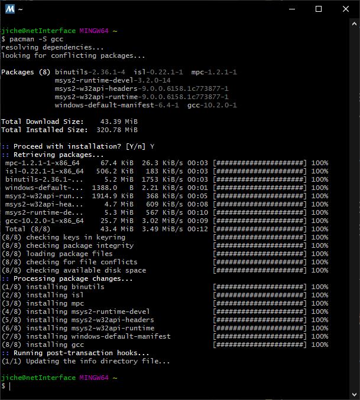
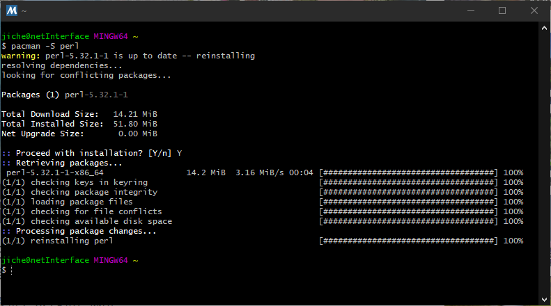
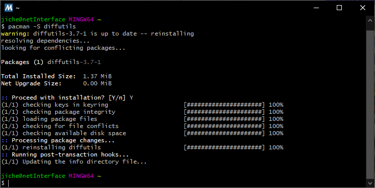
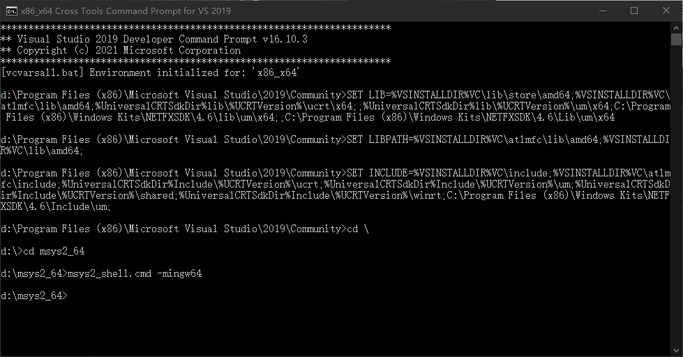
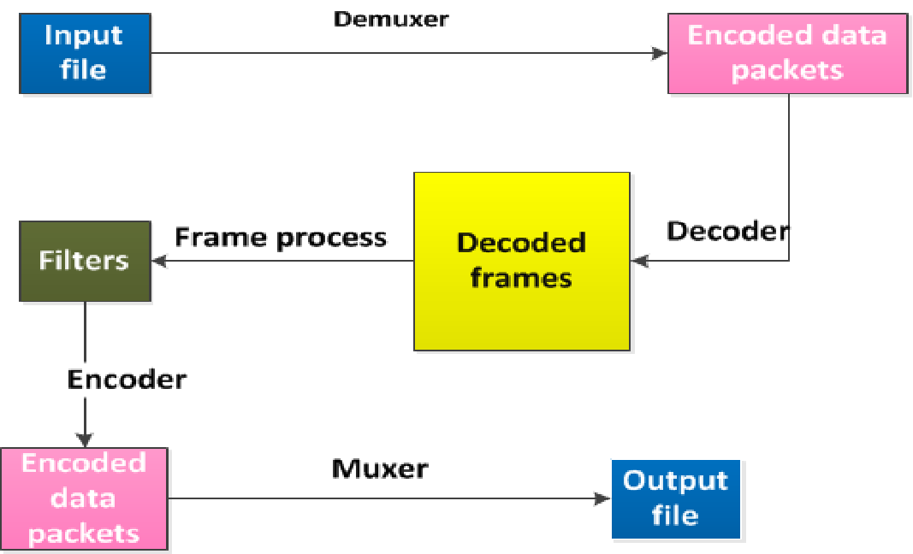

# FFmpegInterop library for Windows

<https://github.com/microsoft/FFmpegInterop>

<https://trac.ffmpeg.org/wiki/CompilationGuide>

<https://windowsforum.com/threads/using-ffmpeg-in-windows-applications.210173/>

[FFmpegInteropX library for Windows](https://github.com/ffmpeginteropx/FFmpegInteropX)

*************************************

## 1 What is FFmpeg / FFmpegInterop / FFmpegInteropX?

[FFmpeg](https://www.ffmpeg.org/) is a free, open-source multimedia framework that includes 
a set of tools which can be used by end users for transcoding, streaming, and playing, as 
well as a set of libraries for developers to use in applications. These libraries are 
valuable to developers as they add support for virtually all media formats including .mkv, 
.flv, and .mov. Projects that use FFmpeg libraries include Google Chrome, VLC, and 
[many more](https://trac.ffmpeg.org/wiki/Projects).

FFmpegInterop is an open-source project that aims to provide an easy way to use FFmpeg 
in Windows 10. FFmpegInteropX is an open-source project that aims to provide an easy 
way to use FFmpeg in Windows 10 UWP Apps.

FFmpegInterop implements a [MediaStreamSource](https://msdn.microsoft.com/en-us/library/windows/apps/windows.media.core.mediastreamsource.aspx) 
which leverages FFmpeg to process media and uses the Windows media pipeline for playback.

## 2 Prerequisites

Getting a compatible build of FFmpeg is required for this to work.

You can simply use the embedded git submodule that points to the latest tested release of FFmpeg.

```batch
git clone --recursive git://github.com/microsoft/FFmpegInterop.git
```

Your `FFmpegInterop` folder should look as follows

```dir
FFmpegInterop\
    ffmpeg\              - ffmpeg source code from the latest release in git://github.com/FFmpeg/FFmpeg.git
    FFmpegInterop\       - FFmpegInterop WinRT component
    Samples\             - Sample Media Player applications in C++, C#, and JavaScript
    Tests\               - Unit tests for FFmpegInterop
    BuildFFmpeg.bat      - Helper script to build FFmpeg libraries as described in https://trac.ffmpeg.org/wiki/CompilationGuide/WinRT
    FFmpegConfig.sh      - Internal script that contains FFmpeg configure options
    FFmpegWin8.1.sln     - Microsoft Visual Studio 2013 solution file for Windows 8.1 and Windows Phone 8.1 apps development
    FFmpegWin10.sln      - Microsoft Visual Studio 2015 solution file for Windows 10 apps development
    LICENSE
    README.md
```

Now that you have the FFmpeg source code, you can follow the instructions on how to build 
[FFmpeg for WinRT apps](https://trac.ffmpeg.org/wiki/CompilationGuide/WinRT). 
Follow the setup instruction carefuly to avoid build issues. 

## 3 Compile FFmpeg Libraries for Windows 10 Runtime

<https://trac.ffmpeg.org/wiki/CompilationGuide/WinRT>

The configuration requires a distinct set of tools, environment variables, and configure 
options. And in this subsection we will conclude with some practical and potentially 
non-obvious information for consuming the FFmpeg DLLs from your win10 app.

### 3.1 Prerequisites

* ​MSYS2 (GNU Make environment)
* ​YASM (x86 assembly code compiler)
* ​gas-preprocessor.pl (ARM assembly pre-processor)

#### 3.1.1 MSYS2 Setup

Download the installer: [msys2-x86_64-latest.tar.xz](msys2-x86_64-latest.tar.xz)
Extract to run the installer. (folder file://D:/msys64/)

Download the installer: [msys2-x86_64-latest.exe](msys2-x86_64-latest.exe)
Click to run the installer. Choose to intall on disk D ( folder file://D:/msys2_64/, 
do NOT install on disk C ).

Update the package database and base packages. Unless your setup file is very recent, 
it will take two steps. First run pacman -Syu on MSYS2 MinGW 64-bit:



Run "MSYS2 MSYS" from Start menu. Update the rest of the base packages with pacman -Su:




Once base MSYS2 is successfully installed, get the latest make package by invoking the 
following command in your MSYS2 shell:



Now MSYS2 is ready for you. You will probably want to install some tools and the 
mingw-w64 GCC to start compiling:

`pacman -S --needed base-devel mingw-w64-x86_64-toolchain`

Also get the latest gcc package:



**Rename link.exe**, in the MSYS2 usr bin folder (E.g. D:\msys2_64\usr\bin\link.exe), 
to be **link_msys.exe** to prevent conflict with MSVC link.exe

Install perl as it will be needed to run 'gas-preprocessor.pl':

`pacman -S perl`



Install also diffutils for configure script:

`pacman -S diffutils`



#### 3.1.2 yasm

```batch
pacman -S nasm 							#汇编工具,安装
pacman -S yasm 							#汇编工具,安装
pacman -S make 							#项目编译工具,必须安装
pacman -S cmake 						#项目编译工具,必须安装
pacman -S diffutils 					#比较工具,ffmpeg configure 生成makefile时会用到,若不安装会警告,最好是安装
pacman -S pkg-config					#库配置工具,编译支持x264和x265用到
pacman -S git							#下载源码用,可以不安装,可自行通过其它方式下载源码
```


### 3.2 Compiling for Windows 10 x64

After completing the setup as instructed, you can invoke BuildFFmpeg.bat script to build or 
do it manually using the instructions in the compilation guide.

Launch VS2019 x86_x64 Cross Tools Command Prompt. E.g.

```batch
C:\ProgramData\Microsoft\Windows\Start Menu\Programs\Visual Studio 2019\Visual Studio Tools\VC\x86_x64 Cross Tools Command Prompt for VS 2019
```

Set the following environment variables in the launched command prompt above:

```batch
SET LIB=%VSINSTALLDIR%VC\lib\store\amd64;%VSINSTALLDIR%VC\Tools\MSVC\14.29.30133\lib\x64;%VSINSTALLDIR%VC\atlmfc\lib\amd64;%UniversalCRTSdkDir%lib\%UCRTVersion%\ucrt\x64;;%UniversalCRTSdkDir%lib\%UCRTVersion%\um\x64;C:\Program Files (x86)\Windows Kits\NETFXSDK\4.6\lib\um\x64;;C:\Program Files (x86)\Windows Kits\NETFXSDK\4.6\Lib\um\x64
SET LIBPATH=%VSINSTALLDIR%VC\atlmfc\lib\amd64;%VSINSTALLDIR%VC\lib\amd64
SET INCLUDE=%VSINSTALLDIR%VC\include;%VSINSTALLDIR%VC\Tools\MSVC\14.29.30133\include;%VSINSTALLDIR%VC\atlmfc\include;%UniversalCRTSdkDir%Include\%UCRTVersion%\ucrt;%UniversalCRTSdkDir%Include\%UCRTVersion%\um;%UniversalCRTSdkDir%Include\%UCRTVersion%\shared;%UniversalCRTSdkDir%Include\%UCRTVersion%\winrt;C:\Program Files (x86)\Windows Kits\NETFXSDK\4.6\Include\um;
```

Open MSYS2 Shell from the command prompt above (use the correct drive and location of 
your MSYS2 installation). Note that the command shell above will close and it may take a 
while for the MSYS2 shell to launch.

<https://blog.csdn.net/ihmhm12345/article/details/109645568>

```batch
cd D:\msys2_64
set MSYS2_PATH_TYPE=inherit
msys2_shell.cmd
```

<https://trac.ffmpeg.org/wiki/CompilationGuide/WinRT>

In the MSYS2 shell verify that all the tools below are setup properly by running the 
following commands:

```batch
$ which cl
/c/Program Files (x86)/Microsoft Visual Studio 14.0/VC/BIN/x86_ARM/cl

$ which link
/c/Program Files (x86)/Microsoft Visual Studio 14.0/VC/BIN/x86_ARM/link

$ which armasm
/c/Program Files (x86)/Microsoft Visual Studio 14.0/VC/BIN/x86_ARM/armasm

$ which yasm
/usr/bin/yasm

$ which cpp
/usr/bin/cpp

$ which gas-preprocessor.pl
/usr/bin/gas-preprocessor.pl
```

Verify that the tools are in the path and point to the right location where MSYS2 
and Visual Studio are installed.

`set MSYS2_BIN="D:\msys2_64\usr\bin\bash.exe"`



In your MSYS2 shell navigate to your cloned FFmpeg folder. E.g.

```batch
cd /F/mygit/FFmpegInterop/ffmpeg
```

Invoke the following make commands:

```batch
mkdir -p Output/Windows10/x64

cd Output/Windows10/x64

../../../configure \
--toolchain=msvc \
--disable-programs \
--disable-d3d11va \
--disable-dxva2 \
--arch=x86_64 \
--enable-shared \
--enable-cross-compile \
--target-os=win32 \
--extra-cflags="-MD -DWINAPI_FAMILY=WINAPI_FAMILY_APP -D_WIN32_WINNT=0x0A00" \
--extra-ldflags="-APPCONTAINER WindowsApp.lib" \
--prefix=../../../Build/Windows10/x64

../../../configure \
--toolchain=msvc \
--disable-programs \
--disable-d3d11va \
--disable-dxva2 \
--arch=x86_64 \
--enable-shared \
--enable-cross-compile \
--enable-encoder=mjpeg \
--enable-parser=mjpeg \
--enable-muxer=mjpeg \
--target-os=win32 \
--extra-cflags="-MD -DWINAPI_FAMILY=WINAPI_FAMILY_APP -D_WIN32_WINNT=0x0A00" \
--extra-ldflags="-APPCONTAINER WindowsApp.lib" \
--prefix=../../../Build/Windows10/x64

make

make install
```


## 4 Use FFmpeg Libraries for Windows 10

* [使用ffmpeg步骤](https://blog.csdn.net/lichen18848950451/article/details/70174577)
* [ffmpeg基本用法(转)](https://blog.csdn.net/sg_zxw/article/details/70597241)
* [Android直播开发之旅(1)：视频直播YUV颜色格式完全解析](https://blog.csdn.net/andrexpert/article/details/69267043)
* [ffmpeg 基本用法](https://www.jianshu.com/p/3c8c4a892f3c)
* [捕获海康威视IPCamera图像，转成OpenCV可以处理的图像（二）](https://blog.csdn.net/wanghuiqi2008/article/details/31410509)
* [用查表法快速转换yv12到RGB【转】](https://www.cnblogs.com/carekee/articles/2359598.html)
* [YV12转RGB24](https://blog.csdn.net/wang_lichun/article/details/7109769)
* [VC++ 使用YV12转RGB（FFMpeg）](https://blog.csdn.net/u012156872/article/details/103691386)
* [FFmpeg 将YUV数据转RGB](https://www.cnblogs.com/nanqiang/p/10116279.html)

**在 include 时要加`extern "C"`，不然会产生 LNK2019 链接错误。这是因为 FFmpeg 是 C 语言写的！！！**

在c++中调用c库，须要加：
```cpp
extern "C"
{
#include "libavcodec/avcodec.h"
#include "libavutil/opt.h"
#include "libavutil/imgutils.h"
}
```

### 4.1 FFmpeg 主要组成部分

<https://www.jianshu.com/p/3c8c4a892f3c>

1. libavformat：各种音视频格式的生成和解析，包括获取解码所需信息以生成解码上下文结构和读取音视频帧等功能，包含demuxers和muxer库；
2. libavcodec：各种类型声音/图像编解码；
3. libavutil：包含一些公共的工具函数；
4. libswscale：用于视频场景比例缩放、色彩映射转换；
5. libpostproc：用于后期效果处理；
6. ffmpeg：是一个命令行工具，用来对视频文件转换格式，也支持对电视卡实时编码；
7. ffsever：是一个HTTP多媒体实时广播流服务器，支持时光平移；
8. ffplay：是一个简单的播放器，使用 ffmpeg 库解析和解码，通过 SDL 显示；

**容器(Container)**\
容器就是一种文件格式，比如flv，mkv等。包含下面5种流以及文件头信息。

**流(Stream)**\
是一种视频数据信息的传输方式，5种流：音频，视频，字幕，附件，数据。

**帧(Frame)**\
帧代表一幅静止的图像，分为I帧，P帧，B帧。

**编解码器(Codec)**\
是对视频进行压缩或者解压缩，CODEC =COde （编码） +DECode（解码）

**复用/解复用(mux/demux)**\
把不同的流按照某种容器的规则放入容器，这种行为叫做复用（mux）\
把不同的流从某种容器中解析出来，这种行为叫做解复用(demux)


### 4.2 FFmpeg 的处理流程



1. FFmpeg程序把-i参数指定的若干文件内容读入到内存，按照输入的参数或者程序默认的参数来处理并且把结果写入到若干的文件中。输入和输出文件可以是计算机文件、管道、网络流、捕获设备等。
2. FFmpeg用libavformat包调用解复用器（demuxers）来读取输入文件中被编码的数据包(packets)，如果有多个输入文件，FFmpeg以有效输入流的最小时间戳来同步，
3. 然后解码器（decoder）从已编码的数据包中产生未被压缩的帧（frame），在那之后调用可选的过滤器。
4. 这些帧被传递到编码器，编码器会产生新的编码包
5. 把新的编码包传递给复用器(muxer)处理并且把结果写入到输出文件中。

#### 4.2.1 Filter


##### 4.2.1.1 Filter Chain


##### 4.2.1.2 Filter Graph


#### 4.2.2 选择媒体流


##### 4.2.2.1 查看帮助


#### 4.2.3 码率、帧率和文件大小


#### 4.2.4 调整视频分辨率


#### 4.2.5 crop filter


#### 4.2.6 翻转和旋转


#### 4.2.7 模糊，锐化


#### 4.2.8 覆盖（画中画)


#### 4.2.9 添加文本


### 4.3 图片支持


#### 4.3.1 裁剪、填充


#### 4.3.2 翻转，旋转，覆盖


### 4.4 其他技巧


## 5 Using FFmpeg in VC++ Project

以 Visual Studio 文本模式（只打开文件不打开整个项目）打开项目的 .vcxproj 文件，找到 
`<ItemGroup></ItemGroup>` 节点，在其中 `<AppxManifest></AppxManifest>` 节点之后添加以下内容：

```xml
  <ItemGroup>
    <AppxManifest Include="Package.appxmanifest">
      <SubType>Designer</SubType>
    </AppxManifest>
    <None Include="$(SolutionDir)ffmpeg\Build\Windows10\$(PlatformTarget)\bin\avcodec-57.dll">
      <DeploymentContent Condition="'$(Configuration)|$(Platform)'=='Debug|Win32'">true</DeploymentContent>
      <DeploymentContent Condition="'$(Configuration)|$(Platform)'=='Release|Win32'">true</DeploymentContent>
      <DeploymentContent Condition="'$(Configuration)|$(Platform)'=='Debug|ARM'">true</DeploymentContent>
      <DeploymentContent Condition="'$(Configuration)|$(Platform)'=='Release|ARM'">true</DeploymentContent>
      <DeploymentContent Condition="'$(Configuration)|$(Platform)'=='Debug|x64'">true</DeploymentContent>
      <DeploymentContent Condition="'$(Configuration)|$(Platform)'=='Release|x64'">true</DeploymentContent>
    </None>
    <None Include="$(SolutionDir)ffmpeg\Build\Windows10\$(PlatformTarget)\bin\avdevice-57.dll">
      <DeploymentContent Condition="'$(Configuration)|$(Platform)'=='Debug|Win32'">true</DeploymentContent>
      <DeploymentContent Condition="'$(Configuration)|$(Platform)'=='Release|Win32'">true</DeploymentContent>
      <DeploymentContent Condition="'$(Configuration)|$(Platform)'=='Debug|ARM'">true</DeploymentContent>
      <DeploymentContent Condition="'$(Configuration)|$(Platform)'=='Release|ARM'">true</DeploymentContent>
      <DeploymentContent Condition="'$(Configuration)|$(Platform)'=='Debug|x64'">true</DeploymentContent>
      <DeploymentContent Condition="'$(Configuration)|$(Platform)'=='Release|x64'">true</DeploymentContent>
    </None>
    <None Include="$(SolutionDir)ffmpeg\Build\Windows10\$(PlatformTarget)\bin\avfilter-6.dll">
      <DeploymentContent Condition="'$(Configuration)|$(Platform)'=='Debug|Win32'">true</DeploymentContent>
      <DeploymentContent Condition="'$(Configuration)|$(Platform)'=='Release|Win32'">true</DeploymentContent>
      <DeploymentContent Condition="'$(Configuration)|$(Platform)'=='Debug|ARM'">true</DeploymentContent>
      <DeploymentContent Condition="'$(Configuration)|$(Platform)'=='Release|ARM'">true</DeploymentContent>
      <DeploymentContent Condition="'$(Configuration)|$(Platform)'=='Debug|x64'">true</DeploymentContent>
      <DeploymentContent Condition="'$(Configuration)|$(Platform)'=='Release|x64'">true</DeploymentContent>
    </None>
    <None Include="$(SolutionDir)ffmpeg\Build\Windows10\$(PlatformTarget)\bin\avformat-57.dll">
      <DeploymentContent Condition="'$(Configuration)|$(Platform)'=='Debug|Win32'">true</DeploymentContent>
      <DeploymentContent Condition="'$(Configuration)|$(Platform)'=='Release|Win32'">true</DeploymentContent>
      <DeploymentContent Condition="'$(Configuration)|$(Platform)'=='Debug|ARM'">true</DeploymentContent>
      <DeploymentContent Condition="'$(Configuration)|$(Platform)'=='Release|ARM'">true</DeploymentContent>
      <DeploymentContent Condition="'$(Configuration)|$(Platform)'=='Debug|x64'">true</DeploymentContent>
      <DeploymentContent Condition="'$(Configuration)|$(Platform)'=='Release|x64'">true</DeploymentContent>
    </None>
    <None Include="$(SolutionDir)ffmpeg\Build\Windows10\$(PlatformTarget)\bin\avutil-55.dll">
      <DeploymentContent Condition="'$(Configuration)|$(Platform)'=='Debug|Win32'">true</DeploymentContent>
      <DeploymentContent Condition="'$(Configuration)|$(Platform)'=='Release|Win32'">true</DeploymentContent>
      <DeploymentContent Condition="'$(Configuration)|$(Platform)'=='Debug|ARM'">true</DeploymentContent>
      <DeploymentContent Condition="'$(Configuration)|$(Platform)'=='Release|ARM'">true</DeploymentContent>
      <DeploymentContent Condition="'$(Configuration)|$(Platform)'=='Debug|x64'">true</DeploymentContent>
      <DeploymentContent Condition="'$(Configuration)|$(Platform)'=='Release|x64'">true</DeploymentContent>
    </None>
    <None Include="$(SolutionDir)ffmpeg\Build\Windows10\$(PlatformTarget)\bin\swresample-2.dll">
      <DeploymentContent Condition="'$(Configuration)|$(Platform)'=='Debug|Win32'">true</DeploymentContent>
      <DeploymentContent Condition="'$(Configuration)|$(Platform)'=='Release|Win32'">true</DeploymentContent>
      <DeploymentContent Condition="'$(Configuration)|$(Platform)'=='Debug|ARM'">true</DeploymentContent>
      <DeploymentContent Condition="'$(Configuration)|$(Platform)'=='Release|ARM'">true</DeploymentContent>
      <DeploymentContent Condition="'$(Configuration)|$(Platform)'=='Debug|x64'">true</DeploymentContent>
      <DeploymentContent Condition="'$(Configuration)|$(Platform)'=='Release|x64'">true</DeploymentContent>
    </None>
    <None Include="$(SolutionDir)ffmpeg\Build\Windows10\$(PlatformTarget)\bin\swscale-4.dll">
      <DeploymentContent Condition="'$(Configuration)|$(Platform)'=='Debug|Win32'">true</DeploymentContent>
      <DeploymentContent Condition="'$(Configuration)|$(Platform)'=='Release|Win32'">true</DeploymentContent>
      <DeploymentContent Condition="'$(Configuration)|$(Platform)'=='Debug|ARM'">true</DeploymentContent>
      <DeploymentContent Condition="'$(Configuration)|$(Platform)'=='Release|ARM'">true</DeploymentContent>
      <DeploymentContent Condition="'$(Configuration)|$(Platform)'=='Debug|x64'">true</DeploymentContent>
      <DeploymentContent Condition="'$(Configuration)|$(Platform)'=='Release|x64'">true</DeploymentContent>
    </None>
    <None Include="$(SolutionDir)FFmpegInterop.pfx" />
  </ItemGroup>
```

完整的 C++ 项目配置文件可以参考示例项目 MediaPlayerCPP.vcxproj 。

可以看到 FFmpeg 的几个 .dll 文件名中都有数字，例如 avformat-57.dll，不同版本的 FFmpeg
编译出来的文件名中这个版本号数字是不一样的，如果手动获取了不同版本的 FFmpeg
代码进行编译，注意在项目中添加 FFmpeg 的 .dll 时正确填写文件名。

如果在之前获取代码文件到本地的步骤中，你获取了最新版本的 FFmpeg 代码，则需要对 FFmpegInterop
项目进行一些改动才能够顺利编译。

在最新版本的 FFmpeg 代码中，FFmpegInterop 在 FFmpegReader.cpp 中调用的 av_free_packet
已被弃用，FFmpeg 在 commit ce70f28a1732c74a9cd7fec2d56178750bd6e457 中已经使用 av_packet_unref
替换了 av_free_packet，因此我们需要在 FFmpegReader.cpp 中改为使用 av_packet_unref。相关讨论可参见
[Build error: avfreepacket deprecated](https://github.com/Microsoft/FFmpegInterop/issues/54)。


### 5.1 使用 FFmpegInterop

<https://www.cnblogs.com/validvoid/p/build-and-use-ffmpeginterop-win10.html>

FFmpegInterop 的工作流程是：

1. 读取媒体文件流。
2. 通过 FFmpegInteropMSS.CreateFFmpegInteropMSSFromStream() 方法创建一个 FFmpegInteropObject，并为其传递媒体文件流和强制软解设置。
3. 调用 FFmpegInteropObject 互操作对象的 GetMediaStreamSource() 方法获得 MediaStreamSource。
4. 将 MediaStreamSource 设置给 MediaElement(C#) 或 VideoTag(Javascript)进行播放。

FFmpegInteropMSS 中提供了两个用于创建 FFmpegInteropObject：
1. CreateFFmpegInteropMSSFromStream:
2. CreateFFmpegInteropMSSFromUri

`CreateFFmpegInteropMSSFromStream` 方法接收三个参数 `IRandomAccessStream^ stream`, 
`bool forceAudioDecode`, `bool forceVideoDecode`，`stream` 即输入的待播放媒体文件流；
`forceAudioDecode` 用于设置是否强制使用 `FFmpeg` 对音频进行软解；`forceVideoDecode` 
用于设置是否强制使用 `FFmpeg` 对视频进行软解。如果不设置强制使用 `FFmpeg` 进行软解，那么 
`MediaStreamSource` 会把压缩数据直接送入 `MediaElement` 进行播放，目前只有 mp3、aac 和 H.264 
支持硬解播放。

> 关于 Windows 10 系统本身支持硬解的格式，可以参考 
> [Supported codecs](https://msdn.microsoft.com/en-us/windows/uwp/audio-video-camera/supported-codecs)。

除了上述三个参数，`CreateFFmpegInteropMSSFromStream` 方法还有一个重载接收第四个参数 
`PropertySet^ ffmpegOptions`。`ffmpegOptions` 用于设置 `FFmpeg` 中 `libavformat`
库所使用的访问资源时要求的协议。所有属性列表可以参阅
[FFmpeg Protocols](https://www.ffmpeg.org/ffmpeg-protocols.html)。

`CreateFFmpegInteropMSSFromUri` 方法用于播放一个 `URI` 提供的媒体流，其接收参数为 
`String^ uri, bool forceAudioDecode, bool forceVideoDecode`，并且同样有一个接收 
`PropertySet^ ffmpegOptions` 参数的重载用于指定协议设置。


## 6 Bailing out

如果在运行代码的时候，IDE提示，***声明已被否决，这时可以通过以下几种方式来解决：

1. 修改项目的配置

Project Properties > Configuration Properties > C/C++ > General > SDL checks关掉

2. 代码中添加编译参数信息

#pragma warning(disable: 4996)    

在增加对 jpg 图像格式支持后再编译，出现编译错误，打开 config.log 发现最后的错误如下：
```batch
check_ld cc
check_cc
BEGIN ./ffconf.yusBh6MK.c
    1	int main(void){ return 0; }
END ./ffconf.yusBh6MK.c
cl -nologo -MD -DWINAPI_FAMILY=WINAPI_FAMILY_APP -D_WIN32_WINNT=0x0A00 -c -Fo./ffconf.CrBabkw6.o ./ffconf.yusBh6MK.c
ffconf.yusBh6MK.c
/F/mygit/FFmpegInterop/ffmpeg/compat/windows/mslink -APPCONTAINER WindowsApp.lib -nologo -out:./ffconf.xGCtyrq4.exe ./ffconf.CrBabkw6.o
LINK : fatal error LNK1104: cannot open file 'MSVCRT.lib'
===> C compiler test failed.
```

怀疑找不到 MSVCRT.lib 的正确路径, 在

```batch
SET LIB=%VSINSTALLDIR%VC\lib\store\amd64;%VSINSTALLDIR%VC\Tools\MSVC\14.29.30133\lib\x64;%VSINSTALLDIR%VC\atlmfc\lib\amd64;%UniversalCRTSdkDir%lib\%UCRTVersion%\ucrt\x64;;%UniversalCRTSdkDir%lib\%UCRTVersion%\um\x64;C:\Program Files (x86)\Windows Kits\NETFXSDK\4.6\lib\um\x64;;C:\Program Files (x86)\Windows Kits\NETFXSDK\4.6\Lib\um\x64
SET LIBPATH=%VSINSTALLDIR%VC\atlmfc\lib\amd64;%VSINSTALLDIR%VC\lib\amd64
SET INCLUDE=%VSINSTALLDIR%VC\include;%VSINSTALLDIR%VC\atlmfc\include;%UniversalCRTSdkDir%Include\%UCRTVersion%\ucrt;%UniversalCRTSdkDir%Include\%UCRTVersion%\um;%UniversalCRTSdkDir%Include\%UCRTVersion%\shared;%UniversalCRTSdkDir%Include\%UCRTVersion%\winrt;C:\Program Files (x86)\Windows Kits\NETFXSDK\4.6\Include\um;
```

中增加了 `%VSINSTALLDIR%VC\Tools\MSVC\14.29.30133\lib\x64;` 再重新执行所以步骤后成功。

在 config 成功后, 进行 `make` 时会产生如下错误
```batch
Cannot open include file: 'stdarg.h'
```

如是我们在环境设置
```batch
SET LIB=%VSINSTALLDIR%VC\lib\store\amd64;%VSINSTALLDIR%VC\Tools\MSVC\14.29.30133\lib\x64;%VSINSTALLDIR%VC\atlmfc\lib\amd64;%UniversalCRTSdkDir%lib\%UCRTVersion%\ucrt\x64;;%UniversalCRTSdkDir%lib\%UCRTVersion%\um\x64;C:\Program Files (x86)\Windows Kits\NETFXSDK\4.6\lib\um\x64;;C:\Program Files (x86)\Windows Kits\NETFXSDK\4.6\Lib\um\x64
SET LIBPATH=%VSINSTALLDIR%VC\atlmfc\lib\amd64;%VSINSTALLDIR%VC\lib\amd64
SET INCLUDE=%VSINSTALLDIR%VC\include;%VSINSTALLDIR%VC\Tools\MSVC\14.29.30133\include;%VSINSTALLDIR%VC\atlmfc\include;%UniversalCRTSdkDir%Include\%UCRTVersion%\ucrt;%UniversalCRTSdkDir%Include\%UCRTVersion%\um;%UniversalCRTSdkDir%Include\%UCRTVersion%\shared;%UniversalCRTSdkDir%Include\%UCRTVersion%\winrt;C:\Program Files (x86)\Windows Kits\NETFXSDK\4.6\Include\um;
```
中又增加了 `%VSINSTALLDIR%VC\Tools\MSVC\14.29.30133\include;`。

编译成功后，在调用过程中将 `YUV` 存储为 `jpeg` 图片时会形成查找格式返回 NULL 的错误，
这只要在初始化时加上下面的内容就行：
```cpp
    av_register_all();
    avcodec_register_all();
```

## 7 refs

* [关于从海康威视或者大华摄像头获取PS数据流中的H264视频数据](https://blog.csdn.net/q742758702/article/details/89510483)
* [FFMPEG+SDL2.0流媒体开发3---简易MP4视频播放器,提取MP4的H264视频序列解码并且显示](https://blog.csdn.net/yue7603835/article/details/42042115)
* [FFmpeg 将YUV数据转RGB](https://www.cnblogs.com/nanqiang/p/10116279.html)
* [VC++ 使用YV12转RGB（FFMpeg）](https://blog.csdn.net/u012156872/article/details/103691386)


