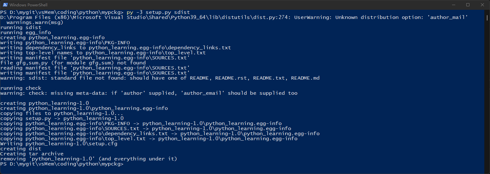

# VS Python

- [Multithreading in Python](https://www.scaler.com/topics/multithreading-in-python/)
- [python安装自己的代码到site-packages](https://blog.csdn.net/kang389110772/article/details/80766344)
- [python安装第三方包的安装路径，dist-packages和site-packages区别](https://halen.blog.csdn.net/article/details/90080103)
- [https://docs.microsoft.com/en-us/visualstudio/python/quickstart-05-python-visual-studio-open-folder?view=vs-2022](https://docs.microsoft.com/en-us/visualstudio/python/quickstart-05-python-visual-studio-open-folder?view=vs-2022)

*****************************

## Index

0. [Overview](#overview) \
   [0.1 安装](#installation) \
   [0.2 dist-packages和site-packages区别](#dist_n_site)
1. [Python Packages](#Python-Packages) \
   [1.1 Creating Package](#Creating-Package) \
   [1.2 Understanding `__init__.py`](#Understanding) \
   [1.3 Import Modules from a Package](#Import-Modules-from-a-Package)
2. [python模块安装到Site-packages教程](#install-modules) \
   [2.1 创建发布](#create-setup) \
   [2.2 安装发布](#install-setup)
3. [创建新项目](#create-project)


## 0 Overview

python默认将第三方模块安装到site-packages, 并且python在执行的时候会搜索这个path。

- **package**: 包含__init__.py的目录, 这一点很重要
- **module**: 单个py文件

### 0.1 安装 <span id="installation"></span>

setup.py:
```python
from setuptools import setup, find_packages

setup(
    name="python_learning",
    version="1.0",
    keywords="request util",
    description="request",
    long_description="description",
    license="MIT Licence",

    author="kevin",
    packages=find_packages(exclude=['cn.kevin.database', 'cn.kevin.es', 'cn.kevin.github', 'cn.kevin.deploy']),
    include_package_data=True,
    platforms="mac",
    install_requires=['requests'],
)
```

[Back to index](#index)


### 0.2 dist-packages和site-packages区别 <span id="dist_n_site"></span>

简单来说
如果是系统自带的python，会使用dist-packages目录；

如果你手动安装python，它会直接使用目录site-packages。

这允许你让两个安装隔离开来。

dist-packages：系统自带的python

site-packages：自己安装的python

Python的包的安装路径如下

1、系统自带python
系统自带软件管理器安装， 模块将被安装到 dist-packages


/usr/lib/python2.7/dist-packages/
从 easy_install 和 pip (注： 是python的软件管理其，python有许许多多的软件) 使用，他们也使用 dist-packages,但是路径是：

/usr/local/lib/python2.7/dist-packages/


2、自己安装或者升级过后的python
python安装第三方库的路径是：

/usr/lib/python2.7/site-packages/
从 easy_install 和 pip 安装的第三方库安装路径是：

/usr/local/lib/python2.7/site-packages/

3、非root用户，从 easy_install 和 pip安装第三方库的安装路径是

~/.local/lib/python2.7/site-packages
有时候需要检查第三方库的路径是否在（笔者在这里碰见过一个坑，正常路径下又某个库，但是import找不到，只能指向这里的对应的库）

~/.local/lib/python2.7/site-packages/external/protobuf/python

[Back to index](#index)


## 1 Python Packages

<https://www.geeksforgeeks.org/python-packages/>
---------------

We usually organize our files in different folders and subfolders based on some 
criteria, so that they can be managed easily and efficiently. For example, we 
keep all our games in a Games folder and we can even subcategorize according to 
the genre of the game or something like this. The same analogy is followed by 
the Python package. 

A Python module may contain several classes, functions, variables, etc. whereas 
a Python package can contains several modules. In simpler terms a package is 
folder that contains various modules as files.


### 1.1 Creating Package

Let's create a package named mypckg that will contain two modules mod1 and mod2. 
To create this module follow the below steps �C 

- Create a folder named mypckg.
- Inside this folder create an empty Python file i.e. `__init__.py`
- Then create two modules mod1 and mod2 in this folder.

Mod1.py
```python
def gfg():
    print("Welcome to GFG")
```

Mod2.py
```python
def sum(a, b):
    return a+b
```

The hierarchy of the our package looks like this �C 
```batch
mypckg
|
|
---__init__.py
|
|
---mod1.py
|
|
---mod2.py
```

[Back to index](#index)


### 1.2 Understanding `__init__.py` <span id="Understanding"></span>

__init__.py helps the Python interpreter to recognise the folder as package. It also 
specifies the resources to be imported from the modules. If the __init__.py is empty 
this means that all the functions of the modules will be imported. We can also specify 
the functions from each module to be made available.

For example, we can also create the __init__.py file for the above module as �C 

`__init__.py`
```python
from .mod1 import gfg
from .mod2 import sum
```

This `__init__.py` will only allow the gfg and sum functions from the mod1 and mod2 
modules to be imported.

[Back to index](#index)


### 1.3 Import Modules from a Package

We can import these modules using the from…import statement and the dot(.) operator. 

Syntax:
```python
import package_name.module_name
```

#### Example: Import Module from package

We will import the modules from the above created package and will use the functions 
inside those modules.
```python
from mypckg import mod1
from mypckg import mod2
 
mod1.gfg()
res = mod2.sum(1, 2)
print(res)
```

Output:
```batch
Welcome to GFG
3
```

[Back to index](#index)


## 2 python模块安装到Site-packages教程 <span id="install-modules"></span>
------------------------------------
请参考 <https://www.jianshu.com/p/10532e6fa9ca>

在使用 python 编码过程中，常常需要定义自己的模块。但 Python 的标准库是不可拓展的，
为此我们可以采用 Python 的 Site-packages 来在此位置中增加和删除自己的或第三方模块。本节介绍 将Python 
模块安装到 Site-packages 的步骤。


### 2.1 创建发布 <span id="create-setup"></span>

#### step 1 创建安装文件 setup.py

以上节中的 mypckg 作为例子，在其中增加 setup.py 文件。内容片段类似下面
```python
from setuptools import setup    # 从"setuptools"模块中引入"setup" 函数

setup(  # 这是一个"setup"函数调用，我们把它的参数分列在多行上
    name="python_learning",         # package 的名称
    version="1.0",
    keywords="gfg sum",
    description="package install",
    long_description="description",
    license="MIT Licence",

    author="whu",
    author_mail='someone@somewhere.com'
    url='https://www.somewhere.com',
    platforms="mac",
    py_modules=['gfg,sum'],
)
```

#### step 2 生成发布

需要将 mypckg 文件夹打包成一个发布文件。

Powershell到mypckg文件夹,
```batch
py  -3  setup.py  sdist
```




### 2.2 安装发布 <span id="install-setup"></span>

```batch
py -3 -m pip install python_learning-1.0.tar.gz
```

查找安装位置，启动 python 环境，运行：
```batch
import site; site.getsitepackages()
```

得到：
```shell
>>> import site; site.getsitepackages()
['D:\\Program Files (x86)\\Microsoft Visual Studio\\Shared\\Python39_64', 
'D:\\Program Files (x86)\\Microsoft Visual Studio\\Shared\\Python39_64\\lib\\site-packages']
```

当安装时未使用管理员权限，则存放到个人文件夹的如下相应位置
```shell
C:\Users\jiche\AppData\Roaming\Python\Python39\site-packages
```

[Back to index](#index)


## 3 创建新项目 <span id="create-project"></span>

new python windows project


[Back to index](#index)


