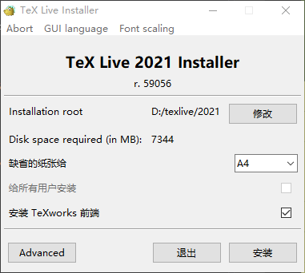

# TeXLive


## 1 Download

Download mirrors list for cn:
https://ctan.org/mirrors/mirmon#cn

location for the setup file:
https://mirrors.aliyun.com/CTAN/systems/texlive/tlnet/install-tl-windows.exe


## 2 Installation

click the downloaded `install-tl-windows.exe`



Follow the instruction to complete the installation.

Run the following commands to check the installation status:
```batch
tex -v
latex -v
xelatex -v
pdflatex -v
```

## 3 Configuration

Copy `tasks.vs.json` to the `.vs` folder of your project root working space.
Create a new folder `textemp` in your project root working space,  
and make sure to add `textemp/` to your `.ignore` file.

