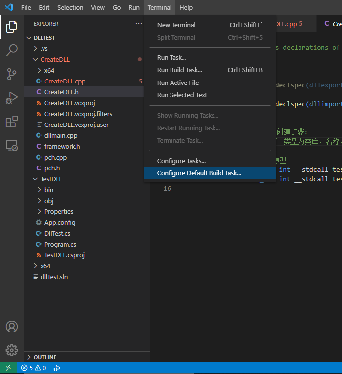

# Configure VS Code for Microsoft C++

<https://code.visualstudio.com/docs/cpp/config-msvc>\
<https://code.visualstudio.com/docs/editor/variables-reference>

************************************


## 1 Start VS Code from developer command prompt for VS 2019

From the Developer Command Prompt, you can open VS Code by entering the following 
commands:
```batch
code
```

To use MSVC from a command line or VS Code, you must run from a Developer Command 
Prompt for Visual Studio. An ordinary shell such as PowerShell, Bash, or the Windows 
command prompt does not have the necessary path environment variables set.

## 2 Build cpp file

Next, you will create a `tasks.json` file to tell VS Code how to build (compile) 
cpp file. This task will invoke the Microsoft C++ compiler to create an executable 
file based on the source code.

From the main menu, choose Terminal > Configure Default Build Task. In the dropdown, 
which will display a tasks dropdown listing various predefined build tasks for C++ 
compilers. Choose cl.exe build active file, which will build the file that is currently 
displayed (active) in the editor.



This will create a `tasks.json` file in a `.vscode` folder and open it in the editor.

Your new `tasks.json` file should look similar to the JSON below:

```json
{
	"version": "2.0.0",
	"tasks": [
		{
			"type": "shell",
			"label": "C/C++: cl.exe build active file",
			"command": "cl.exe",
			"args": [
				"/Zi",
				"/EHsc",
				"/nologo",
				"/Fe:",
				"${fileDirname}\\${fileBasenameNoExtension}.exe",
				"${file}"
			],
			"options": {
				"cwd": "${fileDirname}"
			},
			"problemMatcher": [
				"$msCompile"
			],
			"group": {
				"kind": "build",
				"isDefault": true
			},
			"detail": "compiler: cl.exe"
		}
	]
}
```

## 3 Debug cpp file

Next, you'll create a `launch.json` file to configure VS Code to launch the Microsoft 
C++ debugger when you press `F5` to debug the program. From the main menu, choose 
**Run > Add Configuration...** and then choose **C++ (Windows)**.

You'll then see a dropdown for various predefined debugging configurations. Choose 
**cl.exe build and debug active file**.

VS Code creates a `launch.json` file, opens it in the editor, and builds and runs 'helloworld'.

```json
{
    // Use IntelliSense to learn about possible attributes.
    // Hover to view descriptions of existing attributes.
    // For more information, visit: https://go.microsoft.com/fwlink/?linkid=830387
    "version": "0.2.0",
    "configurations": [
        {
            "name": "cl.exe build and debug active file",
            "type": "cppvsdbg",
            "request": "launch",
            "program": "${fileDirname}\\${fileBasenameNoExtension}.exe",
            "args": [],
            "stopAtEntry": false,
            "cwd": "${workspaceFolder}",
            "environment": [],
            "externalConsole": false,
            "console": "externalTerminal",
            "preLaunchTask": "C/C++: cl.exe build active file"
        }
    ]
}
```

**Notice:**\
`preLaunchTask` 必须与 `tasks.json` 中的 `label` 一致。


## 4 C/C++ configurations

If you want more control over the `C/C++` extension, you can create a 
`c_cpp_properties.json` file, which will allow you to change settings such as the 
path to the compiler, include paths, C++ standard (default is C++17), and more.

You can view the `C/C++` configuration UI by running the command 
**`C/C++: Edit Configurations (UI)`** from the Command Palette (Ctrl+Shift+P).

This opens the `C/C++` Configurations page. When you make changes here, VS Code writes 
them to a file called `c_cpp_properties.json` in the `.vscode` folder.

Visual Studio Code places these settings in `.vscode\c_cpp_properties.json`. If you open 
that file directly, it should look something like this:

```json
{
    "configurations": [
        {
            "name": "Win32",
            "includePath": [
                "${workspaceFolder}/**"
            ],
            "defines": [
                "_DEBUG",
                "UNICODE",
                "_UNICODE"
            ],
            "windowsSdkVersion": "10.0.19041.0",
            "compilerPath": "D:\\Program Files (x86)\\Microsoft Visual Studio\\2019\\Community\\VC\\Tools\\MSVC\\14.29.30133\\bin\\Hostx64\\x64\\cl.exe",
            "cStandard": "c17",
            "cppStandard": "c++17",
            "intelliSenseMode": "windows-msvc-x64"
        }
    ],
    "version": 4
}
```

You only need to add to the Include path array setting if your program includes header 
files that are not in your workspace or in the standard library path.


## 5 Run VS Code outside the Developer Command Prompt `#`

In certain circumstances, it isn't possible to run VS Code from 
**Developer Command Prompt for Visual Studio** (for example, in Remote Development through 
SSH scenarios). In that case, you can automate initialization of 
**Developer Command Prompt for Visual Studio** during the build using the following 
**`tasks.json`** configuration:

```json
{
  "version": "2.0.0",
  "windows": {
    "options": {
      "shell": {
        "executable": "cmd.exe",
        "args": [
          "/C",
          // The path to VsDevCmd.bat depends on the version of Visual Studio you have installed.
          "\"D:/Program Files (x86)/Microsoft Visual Studio/2019/Community/Common7/Tools/VsDevCmd.bat\"",
          "&&"
        ]
      }
    }
  },
  "tasks": [
    {
      "type": "shell",
      "label": "cl.exe build active file",
      "command": "cl.exe",
      "args": [
        "/Zi",
        "/EHsc",
        "/Fe:",
        "${fileDirname}\\${fileBasenameNoExtension}.exe",
        "${file}"
      ],
      "problemMatcher": ["$msCompile"],
      "group": {
        "kind": "build",
        "isDefault": true
      }
    }
  ]
}
```

> **Note:** The path to `VsDevCmd.bat` might be different depending on the Visual Studio 
version or installation path. You can find the path to `VsDevCmd.bat` by opening a 
Command Prompt and running **`dir "\VsDevCmd*" /s`**.

